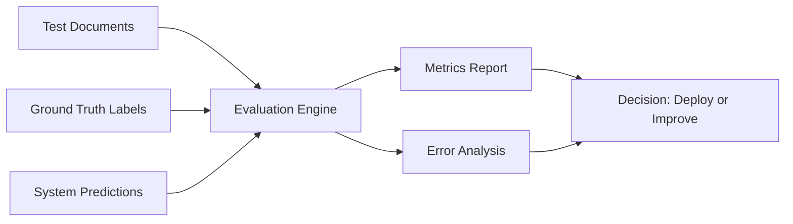
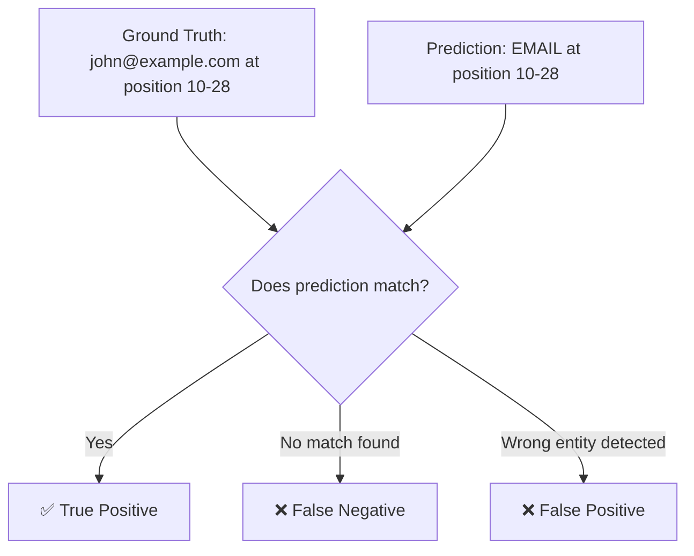

# Product Specification: PII Evaluation Framework

## What Is This?

This is **NOT a PII detector**. It's a **testing tool** that measures how good your PII detection system is.

Think of it like this:
- **Your System**: Tries to find sensitive data in documents
- **This Framework**: Grades how well your system performed

---

## The Problem We're Solving

Organizations build systems to detect emails, phone numbers, government IDs, etc. But they have no way to know:
- ❓ How often does it miss sensitive data? (Security risk)
- ❓ How often does it flag safe text? (Usability problem)
- ❓ Is it good enough for production?

**This framework answers those questions with numbers.**

---

## How It Works (Simple Flow)



**Step 1:** You provide test documents with known sensitive data (ground truth)  
**Step 2:** Your PII system tries to find that data (predictions)  
**Step 3:** This framework compares them and scores the accuracy  

---

## Core Features

### 1. Detection Accuracy Evaluation

**What it does:** Checks if your system found the right entities.



**⚙️ User Choice: Matching Strategy**

You decide how strict the matching should be:

| Strategy | When to Use | Example |
|----------|-------------|---------|
| **Strict (Exact Match)** | Production systems, compliance | Position 10-28 must match exactly |
| **Lenient (Partial Match)** | Development, testing | 50%+ overlap counts as match |
| **Token-Level** | Word-based systems | Matches at word boundaries |

**Metrics calculated:**
- **Precision**: Of everything you flagged, how much was correct?
- **Recall**: Of all sensitive data, how much did you catch?
- **F1-Score**: Balance between precision and recall

### 2. Redaction Verification

**What it does:** Checks if detected data was actually hidden/masked.

**Example:**
```
Original Text: "Email: john@example.com"
After Redaction: "Email: [REDACTED]" ✅ Good
After Redaction: "Email: john@example.com" ❌ LEAK!
```

### 3. Error Analysis

**What it does:** Shows exactly what went wrong and where.

**Output example:**
```
False Negatives (Missed):
- Missed PAN "ABCDE1234F" in document_3 at line 45
- Missed PHONE "+91-9876543210" in document_7 at line 12

False Positives (Wrong):
- Flagged "pan on the stove" as PAN (it's a cooking utensil!)
- Flagged "123-456" as PHONE (not a valid phone number)
```

---

## Input/Output Format

### Input: Ground Truth (JSON)

```json
{
  "document_id": "doc_001",
  "text": "My email is john@example.com",
  "entities": [
    {
      "entity_type": "EMAIL",
      "start": 12,
      "end": 28,
      "text": "john@example.com"
    }
  ]
}
```

### Input: System Predictions (JSON)

```json
{
  "document_id": "doc_001",
  "predictions": [
    {
      "entity_type": "EMAIL",
      "start": 12,
      "end": 28,
      "confidence": 0.95
    }
  ]
}
```

### Output: Evaluation Report (JSON)

```json
{
  "overall_metrics": {
    "precision": 0.92,
    "recall": 0.88,
    "f1_score": 0.90
  },
  "per_entity_metrics": {
    "EMAIL": {"precision": 0.98, "recall": 0.95, "f1": 0.96},
    "PHONE": {"precision": 0.89, "recall": 0.85, "f1": 0.87}
  },
  "errors": {
    "false_negatives": 12,
    "false_positives": 8
  }
}
```

---

## Who Uses This?

| User | Use Case |
|------|----------|
| **ML Engineers** | Test model accuracy before deployment |
| **Security Teams** | Verify no sensitive data leaks |
| **QA Teams** | Regression testing after updates |
| **Compliance Officers** | Generate audit reports |

---

## Success Metrics

| Metric | Target |
|--------|--------|
| Evaluation Accuracy | 100% (framework must correctly classify TP/FP/FN) |
| Processing Speed | < 5 min for 1,000 documents |
| Report Clarity | Non-technical users can understand results |

---

## What's Out of Scope

❌ Building a PII detector (we only evaluate existing ones)  
❌ OCR or PDF parsing (assume text is already extracted)  
❌ Multi-language support (English only for now)  
❌ Real-time API (batch processing only)

---

## Tech Stack

- **Backend**: Python 3.9+
- **UI**: Streamlit (web dashboard)
- **Deployment**: Docker
- **Metrics**: scikit-learn

---