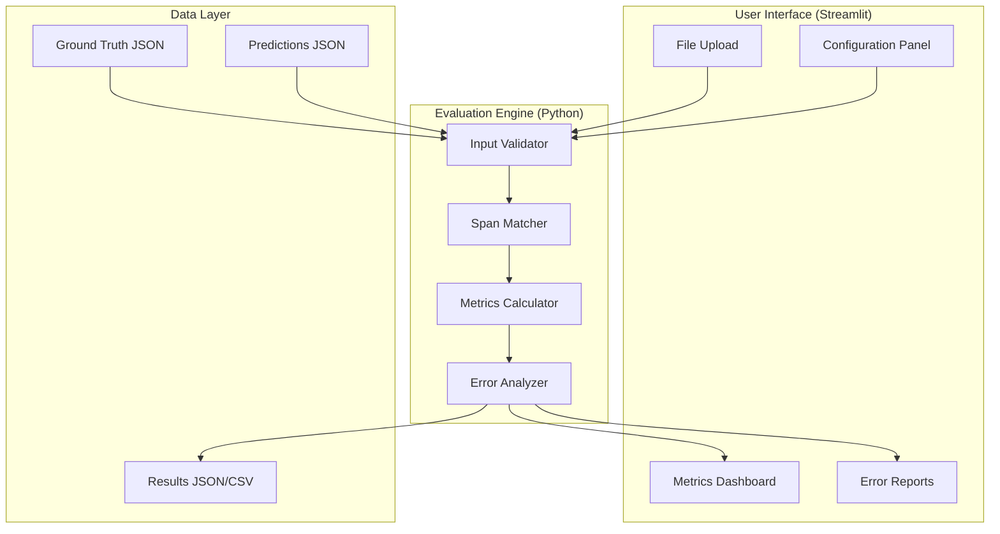
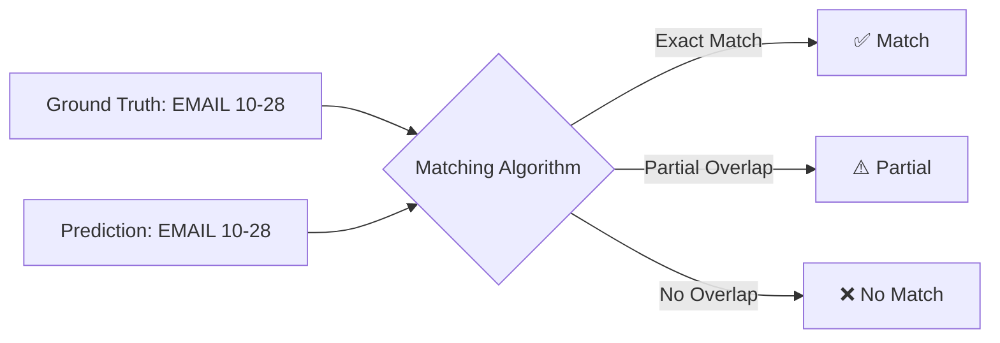
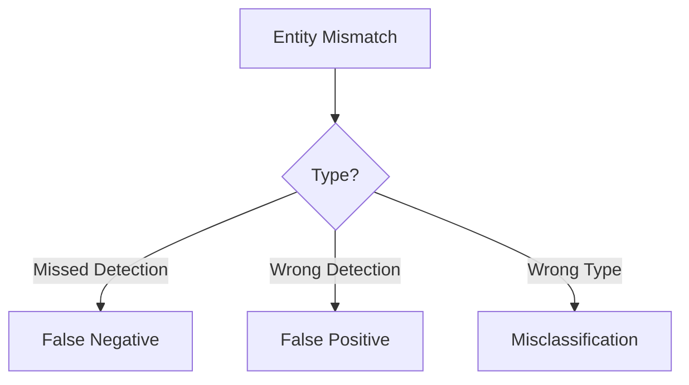
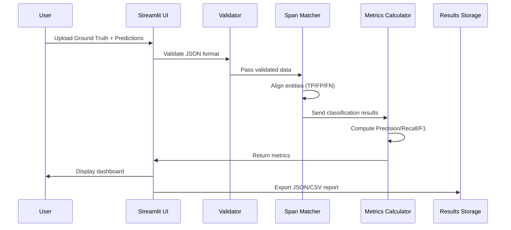
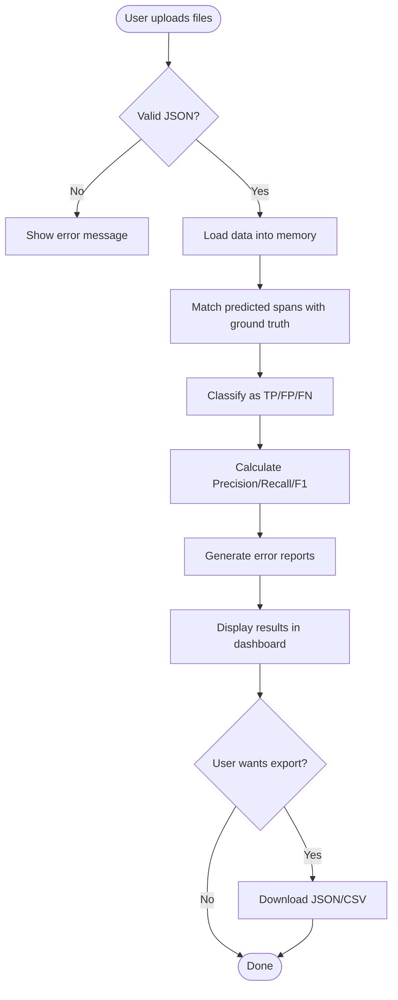
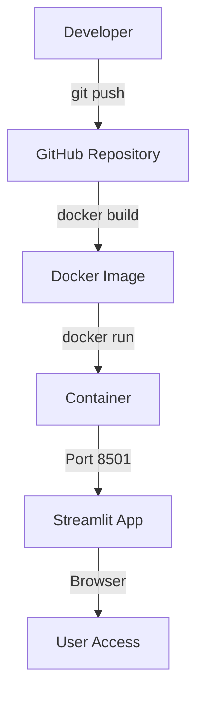

# System Architecture

## Overview

This is a **web-based evaluation tool** that compares PII detection system outputs against ground truth to measure accuracy.



---

## Component Breakdown

### 1. Frontend Layer (Streamlit)

**What users see and interact with.**

```
app.py (Main Dashboard)
├── Upload Section: Drop your JSON files here
├── Config Panel: 
│   ├── Matching Strategy Selector ⚙️
│   │   ○ Strict (Exact Match)
│   │   ○ Lenient (Partial Match - 50% IoU)
│   │   ○ Token-Level Match
│   └── Minimum Confidence Threshold (optional)
├── Run Button: Start evaluation
└── Results Display: Metrics, charts, errors
```

**Pages:**
- `pages/1_📊_Evaluation.py` - Main metrics view
- `pages/2_📈_Metrics.py` - Charts and visualizations  
- `pages/3_🔍_Error_Analysis.py` - Detailed error breakdown
- `pages/4_📄_Reports.py` - Export functionality

---

### 2. Backend Layer (Evaluation Logic)

**The brain of the system.**

#### Module: Span Matcher (`evaluator/span_matcher.py`)

**Job:** Compare predicted entities with ground truth entities.



**User-Selectable Strategies:**

1. **Strict Mode (Exact Match)**
   - Character positions must match perfectly
   - Entity type must match
   - Use for: Production validation, compliance audits

2. **Lenient Mode (Partial Match - IoU)**
   - Intersection over Union (IoU) ≥ 50%
   - Allows slight misalignment
   - Use for: Model development, testing

3. **Token-Level Mode**
   - Matches at word boundaries
   - Ignores whitespace differences
   - Use for: Text-based NLP models

#### Module: Metrics Calculator (`evaluator/metrics.py`)

**Job:** Compute Precision, Recall, F1-Score.

```python
# After matching, we count:
TP = Correct detections
FP = Wrong detections  
FN = Missed entities

Precision = TP / (TP + FP)  # Accuracy of what you found
Recall = TP / (TP + FN)     # Completeness of what you found
F1 = 2 * (Precision * Recall) / (Precision + Recall)
```

#### Module: Error Analyzer (`evaluator/engine.py`)

**Job:** Categorize what went wrong.



---

### 3. Data Models (Pydantic Schemas)

**Ensures data is structured correctly.**

```python
# models/ground_truth.py
class Entity:
    entity_type: str  # "EMAIL", "PAN", "PHONE"
    start: int        # Character position start
    end: int          # Character position end
    text: str         # Actual text of entity

class GroundTruth:
    document_id: str
    text: str
    entities: List[Entity]
```

```python
# models/results.py
class EvaluationResult:
    overall_metrics: Metrics
    per_entity_metrics: List[EntityMetrics]
    false_positives: List[Error]
    false_negatives: List[Error]
```

---

## Data Flow



---

## Evaluation Workflow (Step-by-Step)



---

## Folder Structure

```
pii-benchmark-framework/
│
├── app.py                          # Main Streamlit entry point
│
├── evaluator/                      # Core evaluation logic
│   ├── __init__.py
│   ├── engine.py                   # Main orchestrator
│   ├── span_matcher.py             # Entity matching algorithms
│   ├── metrics.py                  # Precision/Recall/F1 calculation
│   └── redaction_validator.py      # Check if redaction worked
│
├── models/                         # Data structures
│   ├── __init__.py
│   ├── ground_truth.py             # Ground truth schema
│   ├── prediction.py               # Prediction schema
│   └── results.py                  # Evaluation result schema
│
├── utils/                          # Helper functions
│   ├── __init__.py
│   ├── validators.py               # Input validation
│   ├── file_handlers.py            # JSON/CSV I/O
│   └── text_diff.py                # Visual diff generator
│
├── pages/                          # Streamlit multi-page app
│   ├── 1_📊_Evaluation.py
│   ├── 2_📈_Metrics.py
│   ├── 3_🔍_Error_Analysis.py
│   └── 4_📄_Reports.py
│
├── data/                           # Sample datasets
│   ├── sample_ground_truth.json
│   └── sample_predictions.json
│
├── tests/                          # Unit tests
│   ├── unit/
│   └── integration/
│
├── Dockerfile                      # Docker configuration
├── docker-compose.yml              # Docker orchestration
├── requirements.txt                # Python dependencies
└── README.md                       # Setup instructions
```

---

## Technology Choices

| Component | Technology | Why? |
|-----------|-----------|------|
| **Frontend** | Streamlit | Fast dashboard development, Python-only |
| **Backend** | Python 3.9+ | Rich ML libraries, easy to deploy |
| **Data Validation** | Pydantic | Type safety, auto-validation |
| **Metrics** | scikit-learn | Industry-standard implementations |
| **Charts** | Plotly | Interactive visualizations |
| **Deployment** | Docker | Portable, consistent environment |

---

## Deployment Architecture



**Commands:**
```bash
# Build Docker image
docker-compose up --build

# Access application
http://localhost:8501
```

---

## Extensibility Points

### Want to add new features?

1. **New Entity Type**: Just add to `entity_types` list (no code change needed)
2. **New Matching Strategy**: Implement in `span_matcher.py`
3. **New Metric**: Add function in `metrics.py`
4. **New Export Format**: Extend `file_handlers.py`

---

## Security & Privacy

- ✅ All processing happens locally (no external API calls)
- ✅ No data is stored permanently (session-based only)
- ✅ Uploaded files stay in browser session
- ✅ Docker isolation for production deployment

---

**See [project_plan.md](project_plan.md) for implementation timeline.**
