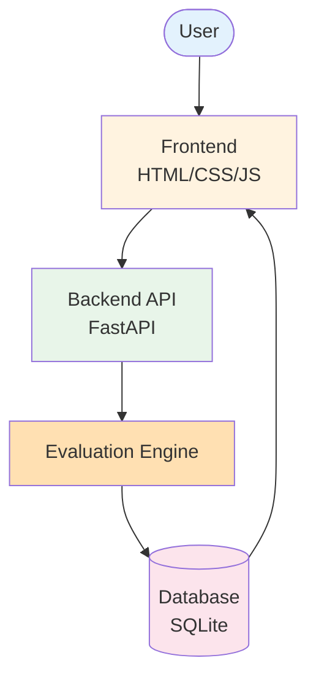
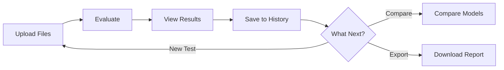
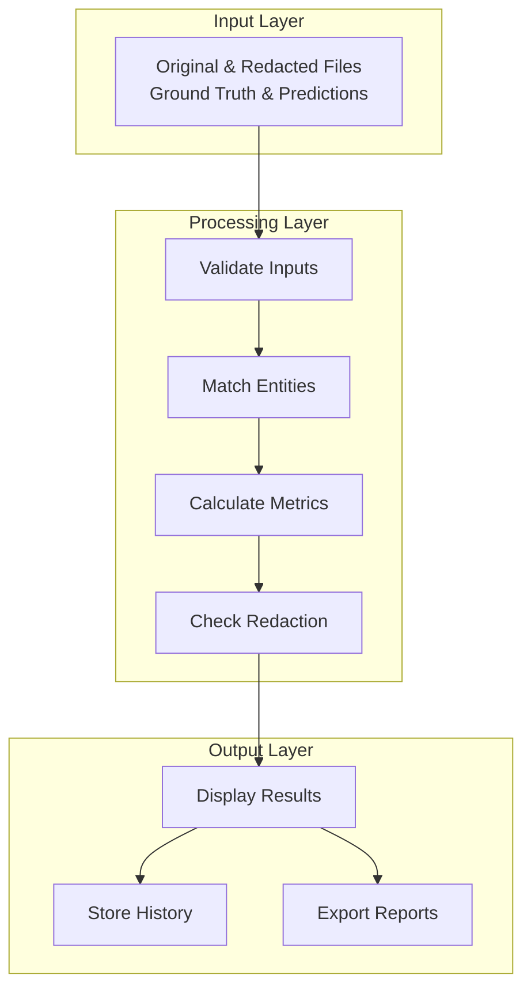
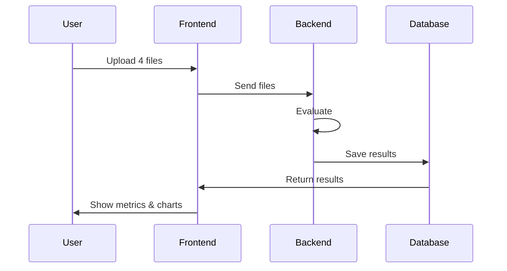
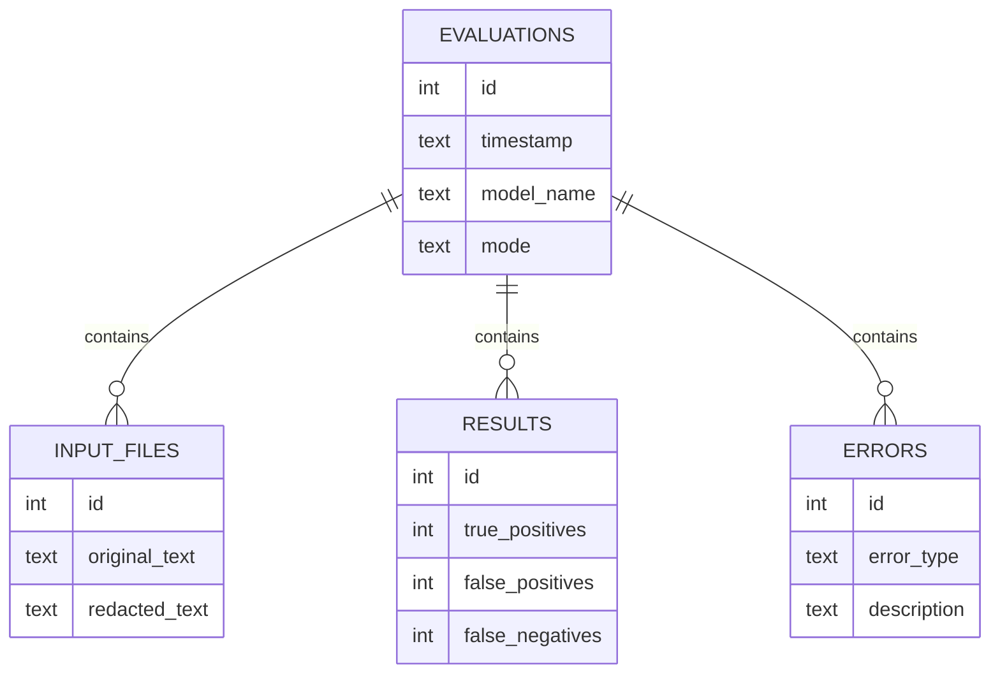
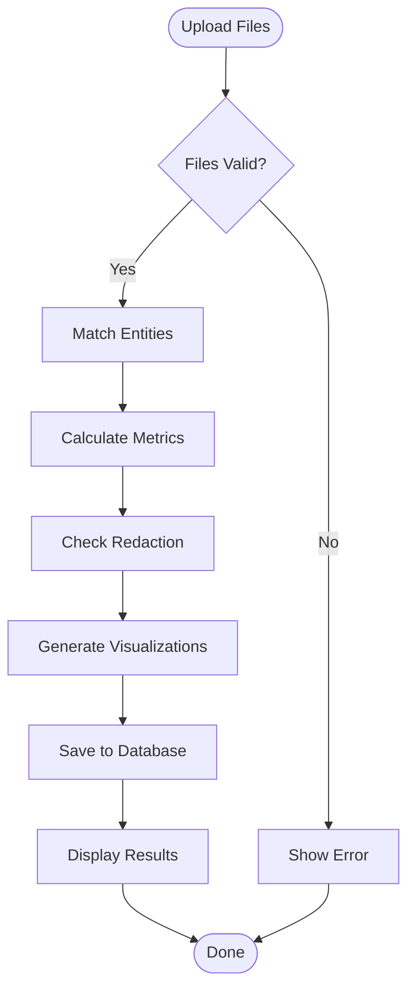
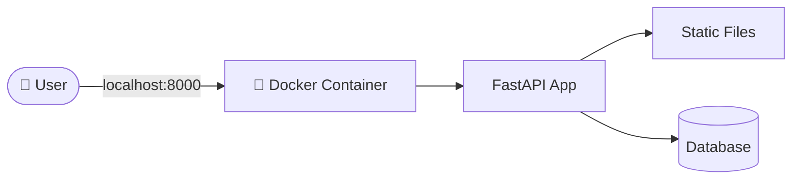

# System Architecture

## Overview

This is a **web-based evaluation framework** that compares PII detection + redaction system outputs against ground truth to measure accuracy, quality, and reliability.

**Core Purpose:** Judge / Examiner for PII systems (NOT a detector itself)

---

## High-Level System Architecture



---

## Simple User Flow



---

## System Components



---

## Evaluation Flow



---

## Database Structure



---

## Evaluation Process Flow



---

## Key Components

### 1. Frontend Layer

**Pages:**

| Page | Purpose |
|------|---------|
| Upload | File upload & mode selection |
| Results | Display metrics, charts, diff view |
| History | Table of past evaluations |
| Compare | Side-by-side model comparison |

---

### 2. Backend Layer

**API Endpoints:**

| Endpoint | Purpose |
|----------|---------|
| `POST /api/evaluate` | Run evaluation |
| `GET /api/history` | Get all evaluations |
| `GET /api/evaluation/{id}` | Get specific results |
| `DELETE /api/evaluation/{id}` | Delete evaluation |
| `GET /api/compare/{id1}/{id2}` | Compare 2 evaluations |
| `GET /api/export/{id}/json` | Export as JSON |
| `GET /api/export/{id}/pdf` | Export as PDF |

---

**Core Modules:**

| Module | Responsibility |
|--------|---------------|
| Input Validator | Validate files & JSON format |
| Span Matcher | Compare entities (strict/lenient) |
| Metrics Calculator | Calculate P, R, F1, Accuracy |
| Redaction Checker | Check 5 redaction categories |
| Error Analyzer | Categorize errors |
| Diff Generator | Create color-coded diff |
| Report Generator | Export JSON/PDF reports |

---

### 3. Database Layer

**4 Main Tables:**

| Table | Stores |
|-------|--------|
| evaluations | Timestamp, model name, mode, metrics |
| input_files | Original & redacted text, JSON labels |
| results | TP, FP, FN, TN, confusion matrix |
| errors | Error type, position, description |

---

## 📁 Project File Structure

```
pii-benchmark-framework/
│
├── backend/                         # Backend application
│   ├── __init__.py
│   ├── main.py                      # FastAPI application entry point
│   │
│   ├── api/                         # API layer
│   │   ├── __init__.py
│   │   ├── routes.py                # API endpoint definitions
│   │   └── models.py                # Pydantic request/response models
│   │
│   ├── core/                        # Core business logic
│   │   ├── __init__.py
│   │   ├── validator.py             # Input validation logic
│   │   ├── matcher.py               # Entity span matching (strict/lenient)
│   │   ├── metrics.py               # Precision, Recall, F1 calculation
│   │   ├── redaction_checker.py     # Redaction verification logic
│   │   ├── error_analyzer.py        # Error categorization & reporting
│   │   ├── diff_generator.py        # Color-coded diff HTML generation
│   │   └── report_generator.py      # JSON/PDF export functionality
│   │
│   ├── database/                    # Database layer
│   │   ├── __init__.py
│   │   ├── db.py                    # SQLite connection & session management
│   │   └── models.py                # SQLAlchemy ORM models
│   │
│   └── utils/                       # Utility functions
│       ├── __init__.py
│       └── helpers.py               # Common helper functions
│
├── frontend/                        # Frontend application
│   ├── index.html                   # Upload page (main entry)
│   ├── results.html                 # Evaluation results display
│   ├── history.html                 # Evaluation history table
│   ├── compare.html                 # Model comparison page
│   │
│   ├── css/                         # Stylesheets
│   │   └── styles.css               # Global styles
│   │
│   └── js/                          # JavaScript modules
│       ├── upload.js                # File upload & form handling
│       ├── results.js               # Results rendering & charts
│       ├── history.js               # History table management
│       └── compare.js               # Comparison logic & visualization
│
├── tests/                           # Test suite
│   ├── __init__.py
│   ├── test_validator.py            # Validator tests
│   ├── test_matcher.py              # Span matcher tests
│   ├── test_metrics.py              # Metrics calculation tests
│   ├── test_redaction.py            # Redaction checker tests
│   └── test_api.py                  # API endpoint tests
│
├── data/                            # Sample & test data
│   └── sample/                      # Sample evaluation files
│       ├── original.txt             # Sample original text
│       ├── redacted.txt             # Sample redacted text
│       ├── ground_truth.json        # Sample ground truth labels
│       └── predictions.json         # Sample prediction labels
│
├── database/                        # Database storage
│   └── evaluations.db               # SQLite database file
│
├── Dockerfile                       # Docker image definition
├── docker-compose.yml               # Docker Compose configuration
├── requirements.txt                 # Python dependencies
├── .gitignore                       # Git ignore rules
├── README.md                        # Project documentation
├── PRODUCT_SPEC.md                  # Product specification
├── architecture.md                  # System architecture (this file)
└── project_plan.md                  # Development plan
```

---

## 🎨 Design Highlights

### Evaluation Modes

| Mode | Description | Use Case |
|------|-------------|----------|
| **Strict** | Exact position match | Production testing |
| **Lenient** | 50%+ overlap allowed | Development/debugging |

### Redaction Categories

| Category | Description | Color Code |
|----------|-------------|------------|
| Correct | Fully masked | Green |
| Leak | Not redacted | Red |
| Over | Non-sensitive masked | Bright Yellow (Gold) |
| Under | Partially masked | Dark Orange |

### Key Metrics

- **Precision**: Accuracy of detections
- **Recall**: Coverage of actual entities
- **F1-Score**: Balanced measure
- **Accuracy**: Overall correctness

---

## 🔧 Technology Stack

### Core Technologies

| Layer | Technology | Version | Purpose |
|-------|------------|---------|---------|
| **Frontend** | HTML5 | - | Page structure |
| | CSS3 | - | Styling & layout |
| | JavaScript (ES6+) | - | Client-side logic |
| | Chart.js | 4.x | Data visualization |
| **Backend** | Python | 3.9+ | Core language |
| | FastAPI | 0.100+ | Web framework & API |
| | Pydantic | 2.x | Data validation |
| | Uvicorn | 0.23+ | ASGI server |
| **Database** | SQLite | 3.x | Data persistence |
| **Testing** | pytest | 7.x | Unit & integration tests |
| **Metrics** | scikit-learn | 1.3+ | Metric calculations |
| **PDF Export** | WeasyPrint | 60+ | PDF generation |
| **DevOps** | Docker | 24.x | Containerization |
| | Docker Compose | 2.x | Multi-container orchestration |

### Python Libraries

```
fastapi>=0.100.0
uvicorn[standard]>=0.23.0
pydantic>=2.0.0
scikit-learn>=1.3.0
weasyprint>=60.0
chart.js (via CDN)
```

---

## 🚀 Deployment



**Simple Docker Setup:**
- Single container runs everything
- Port 8000 for web access
- SQLite database in volume (persistent storage)
- Easy one-command deployment

---
